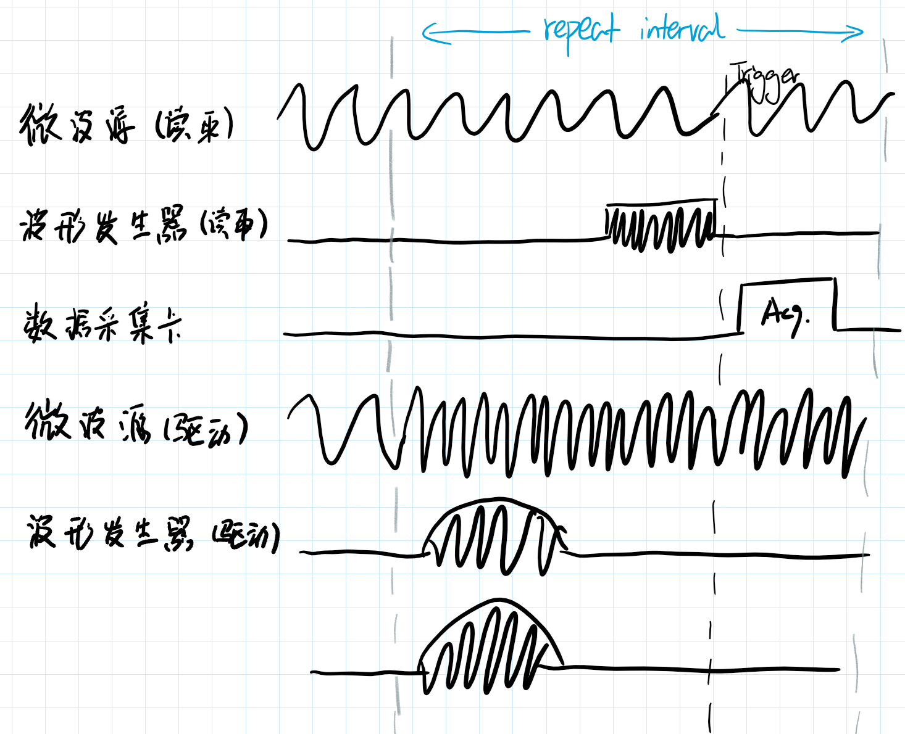

找到量子比特的操作频率，是量子比特标定实验的第二步。常用的方法是扫频，用不同频率的信号驱动量子比特，在正确的频率时，读出的信号会出现强烈的变化（读出信号的参数在前面实验已经确定）。

## 所需资源：

微波源（读取）、波形发生器（读取）、数据采集卡（带解模）、微波源（比特驱动）

## 实验过程

1. 加载参数表，并对参数进行合法性检查，查询/计算需要设置到仪器的参数值，计算/调用上传到波形发生器的波形；

2. 下发对应参数值（包括波形上传）到仪器，部分对硬件循环的控制参数也会在此时设置，比如触发设备（由数采卡发出，比如）的触发间隔；

3. 检查所有实验设备（包括上未列出但已开机其他设备）的输出开关状态，关闭不必要的输出，运行设备（开始接收触发信号），打开设备信号输出，打开触发输出，开始采集数据；



如图，实验中最内层循环各个仪器通道输出内容及时序示意，参与扫参的参数只有“微波源（驱动）”的信号频率，比如以`registry[line/(node/qubit/1/XY_line)/LO/frequency]`为中心，在3MHz范围内扫51个点。对于每个扫过的点，都执行图示序列5000次（该值来自`reigstry[sequence/repeat]`），软件将记录5000次重复中测量信号的平均值，此为在一个扫参点的实验。

4. 完成一个扫参点的实验后，变更扫参相关参数，在这个实验中是微波源（驱动）的信号频率，执行下一个扫参点的实验；

5. 完成所有扫参点的实验之后，收集并保存数据，以及实验配置的备份；停止设备运行（停止输出、停止接收触发信号）。

附上实验参数表和执行脚本。

## 执行脚本

```python
Registry('balah/registry_example.json')

sequence('operation/other/drive_1', 'operation/other/drive_2')  # 两个波形同时播放。
sequence('operation/RO/1', 'operation/RO/2')  # 在上一行波形之后接这个波形。
sweep(
	'line/%s/LO/frequency' % reg["node/qubit/1/XY_line"],
    center=reg['line/%s/LO/frequency' % reg["node/qubit/1/XY_line"]],
    span=3e6,
    n_pts=51,
)
log('ADC - Averaged #1', 'ADC - Averaged #2')
data = measure()
```

